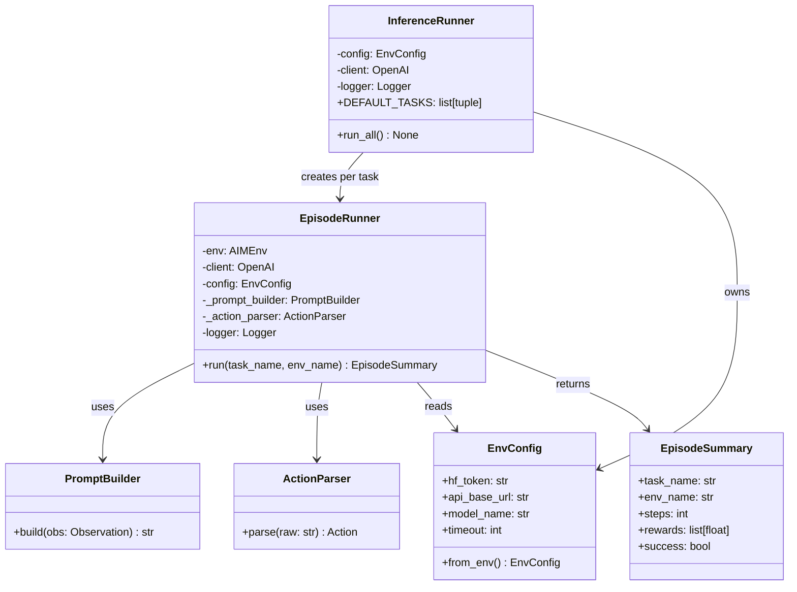

# Design Document: inference-refactor

## Overview

This design refactors `inference.py` from a single-module procedural script into a well-structured,
production-ready Python module. The refactor introduces four dedicated classes (`EnvConfig`,
`PromptBuilder`, `ActionParser`, `EpisodeRunner`) and one top-level orchestrator (`InferenceRunner`),
plus two dataclasses (`EnvConfig`, `EpisodeSummary`). Public log output format and task definitions
are preserved exactly so existing CI pipelines remain unaffected.

The four design pillars are:

1. **Architecture & Modularity** — each concern lives in its own class with a narrow interface.
2. **Robustness & Error Handling** — typed exceptions, timeout support, per-task fault isolation.
3. **Readability & Documentation** — Google-style docstrings, PEP 8, Python 3.10+ type hints.
4. **Performance** — list comprehensions, no redundant allocations.

---

## Architecture



### Module layout

All code lives in a single refactored `inference.py` file (no new files required). The class
ordering within the file follows dependency order:

```
EnvConfig  →  PromptBuilder  →  ActionParser  →  EpisodeSummary  →  EpisodeRunner  →  InferenceRunner
```

---

## Components and Interfaces

### EnvConfig

```python
@dataclass
class EnvConfig:
    hf_token: str
    api_base_url: str
    model_name: str
    timeout: int = 30

    @classmethod
    def from_env(cls) -> "EnvConfig": ...
```

- `from_env` reads `HF_TOKEN` (required), `API_BASE_URL` (default `"https://api.openai.com/v1"`),
  `MODEL_NAME` (default `"gpt-4o-mini"`), and `INFERENCE_TIMEOUT` (default `30`) from `os.environ`.
- Raises `ValueError("HF_TOKEN environment variable is required")` when `HF_TOKEN` is absent.

### PromptBuilder

```python
class PromptBuilder:
    def build(self, obs: Observation) -> str: ...
```

- Stateless; no constructor arguments needed.
- Renders inbox as `"  (empty)"` when `obs.inbox` is empty.
- Renders each email line as `  - id=<id> subject=<subject!r> sender=<sender> preview=<preview!r>`.
- Always includes all four action schemas and `obs.time_left` / `obs.step_count`.

### ActionParser

```python
class ActionParser:
    def parse(self, raw: str) -> Action: ...
```

- Strips markdown fences via `re.search(r"```(?:json)?\s*(\{.*?\})\s*```", raw, re.DOTALL)`.
- Raises `ValueError` (wrapping original exception text) on JSON parse failure.
- Raises `ValueError` (wrapping original exception text) on `Action(**parsed)` construction failure.

### EpisodeSummary

```python
@dataclass
class EpisodeSummary:
    task_name: str
    env_name: str
    steps: int
    rewards: list[float]
    success: bool
```

### EpisodeRunner

```python
class EpisodeRunner:
    def __init__(self, env: AIMEnv, client: OpenAI, config: EnvConfig) -> None: ...
    def run(self, task_name: str, env_name: str) -> EpisodeSummary: ...
```

- Calls `env.reset()` exactly once at the start of `run()`.
- Passes `timeout=config.timeout` to every `client.chat.completions.create(...)` call.
- On `TimeoutError` or `ConnectionError`: logs `WARNING`, falls back to `Action(type="submit")`.
- On any other exception from the LLM call: records error string, falls back to `Action(type="submit")`.
- On `env.step` exception: logs error, sets `done = True` to terminate loop.
- Emits `[STEP]` log lines at `INFO` level; error string appears in `error=` field when fallback used.
- Returns `EpisodeSummary` with `success = score >= 0.5`.

### InferenceRunner

```python
class InferenceRunner:
    DEFAULT_TASKS: list[tuple[str, TaskConfig]] = [...]

    def __init__(
        self,
        config: EnvConfig | None = None,
        tasks: list[tuple[str, TaskConfig]] | None = None,
    ) -> None: ...

    def run_all(self) -> None: ...
```

- `DEFAULT_TASKS` preserves the original three task configs (easy/medium/hard) with identical seeds,
  email counts, and budgets.
- `run_all()` iterates tasks; wraps each `EpisodeRunner.run()` call in a try/except — logs `ERROR`
  and continues on unhandled exceptions.
- Emits `[START]` at `INFO` before each episode and `[END]` at `INFO` after.
- Configures a `StreamHandler` writing to `sys.stdout` on the `"inference"` logger.

---

## Data Models

### Existing models (unchanged, from `env` package)

| Type | Source | Role |
|---|---|---|
| `Observation` | `env` | Returned by `env.reset()` and `env.step()` |
| `Action` | `env.models` | Pydantic model for agent actions |
| `TaskConfig` | `env.models` | RL task configuration |
| `AIMEnv` | `env` | RL environment |
| `Grader` | `env` | Episode scoring utility |

### New dataclasses

| Type | Fields | Notes |
|---|---|---|
| `EnvConfig` | `hf_token`, `api_base_url`, `model_name`, `timeout` | Runtime config; constructed via `from_env()` |
| `EpisodeSummary` | `task_name`, `env_name`, `steps`, `rewards`, `success` | Per-episode metrics |

---

## Correctness Properties

*A property is a characteristic or behavior that should hold true across all valid executions of a
system — essentially, a formal statement about what the system should do. Properties serve as the
bridge between human-readable specifications and machine-verifiable correctness guarantees.*

### Property 1: EnvConfig field round-trip

*For any* triple of non-empty strings `(hf_token, api_base_url, model_name)`, constructing
`EnvConfig(hf_token=hf_token, api_base_url=api_base_url, model_name=model_name)` SHALL produce an
object whose fields equal the inputs exactly.

**Validates: Requirements 1.1**

---

### Property 2: ActionParser round-trip

*For any* valid `Action` instance, serializing it to JSON and then calling `ActionParser().parse()`
on that JSON string SHALL return an `Action` equal to the original (i.e.,
`ActionParser().parse(json.dumps(action.model_dump())) == action`).

**Validates: Requirements 3.3, 3.6**

---

### Property 3: Markdown-fenced JSON is transparent

*For any* valid Action JSON string `s`, wrapping it in markdown fences
(`` ```json\n{s}\n``` ``) and calling `ActionParser().parse()` SHALL return the same `Action` as
calling `ActionParser().parse(s)` directly.

**Validates: Requirements 3.2**

---

### Property 4: Invalid JSON always raises ValueError

*For any* string that is not valid JSON, `ActionParser().parse()` SHALL raise a `ValueError` whose
message contains the text of the underlying `json.JSONDecodeError`.

**Validates: Requirements 3.4**

---

### Property 5: Prompt always contains all action types

*For any* `Observation` (with any inbox size, time_left, and step_count),
`PromptBuilder().build(obs)` SHALL return a string containing all four action type keywords:
`"open"`, `"classify"`, `"detect_phishing"`, and `"submit"`.

**Validates: Requirements 2.4**

---

### Property 6: Prompt reflects observation values

*For any* `Observation` with arbitrary `time_left` and `step_count`,
`PromptBuilder().build(obs)` SHALL return a string that contains both `str(obs.time_left)` and
`str(obs.step_count)`.

**Validates: Requirements 2.5**

---

### Property 7: Non-empty inbox renders all email fields

*For any* non-empty list of emails in `obs.inbox`, `PromptBuilder().build(obs)` SHALL contain each
email's `id`, `repr(subject)`, `sender`, and `repr(preview)` in the output string.

**Validates: Requirements 2.3**

---

### Property 8: EpisodeSummary rewards length equals step count

*For any* episode that completes after N env steps (before `done=True`), the returned
`EpisodeSummary.rewards` list SHALL have exactly N entries and `EpisodeSummary.steps == N`.

**Validates: Requirements 5.3, 5.6**

---

### Property 9: Any LLM exception produces submit fallback

*For any* exception type raised by the LLM client during `EpisodeRunner.run()`, the action used for
that step SHALL be `Action(type="submit")` and the error string SHALL appear in the `[STEP]` log
line's `error=` field.

**Validates: Requirements 4.2, 4.4**

---

### Property 10: run_all executes every task

*For any* list of N tasks passed to `InferenceRunner`, calling `run_all()` SHALL invoke
`EpisodeRunner.run` exactly N times (once per task), even if some tasks raise exceptions.

**Validates: Requirements 7.2, 7.3**

---

## Error Handling

| Scenario | Handler | Fallback |
|---|---|---|
| `HF_TOKEN` missing | `EnvConfig.from_env` | Raises `ValueError` — process exits |
| LLM `TimeoutError` / `ConnectionError` | `EpisodeRunner` | `WARNING` log + `Action(type="submit")` |
| Any other LLM exception | `EpisodeRunner` | `WARNING` log + `Action(type="submit")`, error in `[STEP]` |
| `env.step` exception | `EpisodeRunner` | `ERROR` log + `done = True` |
| `ActionParser` JSON error | `ActionParser` | Re-raises as `ValueError` (caught by `EpisodeRunner`) |
| `EpisodeRunner.run` unhandled exception | `InferenceRunner.run_all` | `ERROR` log + continue to next task |

All exceptions are logged before fallback. No bare `except:` clauses — minimum catch is
`except Exception as exc`.

---

## Testing Strategy

### Unit tests (example-based)

Focus on concrete scenarios and edge cases:

- `EnvConfig.from_env` with `HF_TOKEN` missing → `ValueError` with exact message
- `EnvConfig.from_env` with `API_BASE_URL` / `MODEL_NAME` missing → correct defaults
- `PromptBuilder.build` with empty inbox → `"  (empty)"` in output
- `EpisodeRunner.run` calls `env.reset()` exactly once
- `EpisodeRunner.run` calls `env.get_result()` and `Grader().grade_episode()` exactly once
- `EpisodeRunner.run` terminates loop when `env.step` raises
- `InferenceRunner` uses `DEFAULT_TASKS` when no `tasks` override provided
- Log lines match `[START]`, `[STEP]`, `[END]` format strings exactly

### Property-based tests (pytest-hypothesis)

Use [Hypothesis](https://hypothesis.readthedocs.io/) — minimum 100 iterations per property.

Each test is tagged with a comment in the format:
`# Feature: inference-refactor, Property <N>: <property_text>`

| Property | Strategy |
|---|---|
| P1: EnvConfig field round-trip | `st.text(min_size=1)` × 3 fields |
| P2: ActionParser round-trip | Generate `Action` instances, serialize to JSON |
| P3: Markdown-fenced JSON transparent | Same as P2, wrap in fences |
| P4: Invalid JSON raises ValueError | `st.text()` filtered to non-JSON strings |
| P5: Prompt contains all action types | Generate `Observation` with `st.builds` |
| P6: Prompt reflects obs values | Generate `Observation` with varying `time_left`/`step_count` |
| P7: Non-empty inbox renders all fields | Generate non-empty email lists |
| P8: Rewards length equals step count | Mock env returning N steps, verify summary |
| P9: Any LLM exception → submit fallback | `st.from_type(Exception)` or sampled exception types |
| P10: run_all executes every task | `st.lists(...)` of task tuples, mock EpisodeRunner |

### Static analysis

- `mypy --strict inference.py` — verifies all type annotations (Requirement 8.1)
- `ruff check inference.py` — PEP 8 compliance, line length ≤ 99 (Requirement 8.3)
