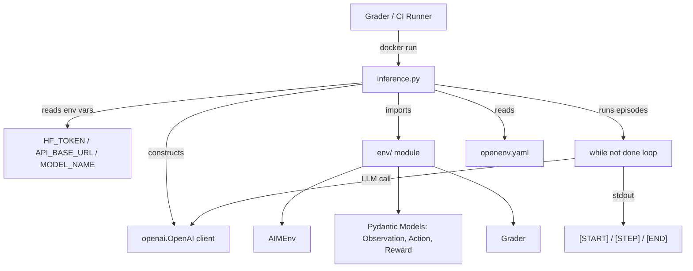

# Design Document: openenv-rl-execution

## Overview

This design describes the refactor of the AIM-Env Platform from a full-stack web application (React + FastAPI) into a strictly compliant, lightweight OpenEnv RL execution environment. The deliverable is a single `inference.py` entry point, a lean `Dockerfile`, and an `openenv.yaml` config that together pass the Round 1 automated grader with a perfect score.

The existing `env/` module (models, environment logic, grader, reward) is reused as-is. The React frontend, FastAPI backend, and all Node/npm artifacts are irrelevant to the grader and are not included in the new Docker image.

## Architecture



The execution flow is entirely linear and self-contained within a single Python process. No web server, no database, no frontend assets.

## Components and Interfaces

### inference.py

Single entry point. Responsibilities:

- Read and validate environment variables
- Construct the `openai.OpenAI` client
- Load task configurations (Easy / Medium / Hard)
- For each task: call `reset()`, run the `while not done` loop, print formatted stdout lines
- Call the grader and print `[END]`

Key functions:

```python
def get_env_config() -> tuple[str, str, str]:
    """Read HF_TOKEN (required), API_BASE_URL, MODEL_NAME from environment.
    Raises ValueError if HF_TOKEN is missing."""

def format_start(task_name: str, env_name: str, model_name: str) -> str:
    """Return [START] line."""

def format_step(step: int, action: str, reward: float, done: bool, error: str | None) -> str:
    """Return [STEP] line with exact formatting."""

def format_end(success: bool, steps: int, rewards: list[float]) -> str:
    """Return [END] line."""

def run_episode(env: AIMEnv, client: OpenAI, model: str, task_name: str, env_name: str) -> None:
    """Execute one full episode, printing stdout lines."""
```

### env/ module (existing, unchanged)

| Symbol | Type | Purpose |
|---|---|---|
| `Observation` | Pydantic model | Agent view of environment state |
| `Action` | Pydantic model | Agent operation |
| `Reward` | Pydantic model | Step reinforcement signal |
| `TaskConfig` | Pydantic model | Episode configuration |
| `EpisodeResult` | Pydantic model | End-of-episode aggregate |
| `AIMEnv` | class | `reset()`, `step()`, `get_result()` |
| `Grader` | class | `grade_episode(result) -> float` |

A thin `state()` accessor will be added to `AIMEnv` to satisfy the OpenEnv spec:

```python
def state(self) -> Observation:
    return self.current_obs
```

### openenv.yaml

Environment metadata consumed by the grader registry:

```yaml
name: aim-email-triage
version: "1.0"
description: "Email triage RL environment with LLM agent"
tasks:
  - name: easy
    difficulty: easy
    seed: 42
    num_emails: 3
    time_budget: 20
  - name: medium
    difficulty: medium
    seed: 137
    num_emails: 7
    time_budget: 30
  - name: hard
    difficulty: hard
    seed: 999
    num_emails: 12
    time_budget: 40
```

### Dockerfile (new, lean)

```dockerfile
FROM python:3.10-slim
WORKDIR /app
COPY requirements.txt .
RUN pip install --no-cache-dir -r requirements.txt
COPY . .
CMD ["python", "inference.py"]
```

`requirements.txt` contains only:
```
openai
pydantic
```

## Data Models

All models are Pydantic v2 and live in `env/models.py`. No changes required to existing models.

### Stdout Format Contract

| Line | Format |
|---|---|
| `[START]` | `[START] task=<task_name> env=<benchmark> model=<model_name>` |
| `[STEP]` | `[STEP] step=<n> action=<action_str> reward=<0.00> done=<true\|false> error=<msg\|null>` |
| `[END]` | `[END] success=<true\|false> steps=<n> rewards=<r1,r2...rn>` |

Formatting invariants:
- Rewards: always 2 decimal places (`f"{r:.2f}"`)
- Booleans: lowercase `"true"` / `"false"` (not Python `True`/`False`)
- Rewards list in `[END]`: comma-separated, no spaces, each to 2 decimal places
- `error` field: literal string `"null"` when no error

### Environment Variable Contract

| Variable | Required | Default |
|---|---|---|
| `HF_TOKEN` | yes — `ValueError` if absent | — |
| `API_BASE_URL` | no | `"https://api.openai.com/v1"` |
| `MODEL_NAME` | no | `"gpt-4o-mini"` |

## Correctness Properties

*A property is a characteristic or behavior that should hold true across all valid executions of a system — essentially, a formal statement about what the system should do. Properties serve as the bridge between human-readable specifications and machine-verifiable correctness guarantees.*

### Property 1: Missing HF_TOKEN raises ValueError

*For any* execution environment where `HF_TOKEN` is not set, calling `get_env_config()` SHALL raise a `ValueError`.

**Validates: Requirements 1.1**

### Property 2: [START] line contains all required fields

*For any* combination of task name, environment name, and model name, `format_start()` SHALL return a string that contains `[START]`, `task=<value>`, `env=<value>`, and `model=<value>`.

**Validates: Requirements 2.1**

### Property 3: [STEP] line contains all required fields with correct formatting

*For any* step number, action string, reward float, done boolean, and optional error string, `format_step()` SHALL return a string containing `[STEP]`, `step=<n>`, `action=<value>`, `reward=<value>`, `done=<true|false>`, and `error=<value>`, where the reward is formatted to exactly 2 decimal places and the boolean is lowercase.

**Validates: Requirements 2.2, 2.4, 2.5**

### Property 4: [END] line contains all required fields

*For any* success boolean, step count, and list of reward floats, `format_end()` SHALL return a string containing `[END]`, `success=<true|false>`, `steps=<n>`, and `rewards=<comma-separated-values>`, where each reward is formatted to exactly 2 decimal places.

**Validates: Requirements 2.3, 2.4, 2.5**

### Property 5: Grader always returns a score in [0.0, 1.0]

*For any* `EpisodeResult` with accuracy values in [0.0, 1.0], `Grader.grade_episode()` SHALL return a float in the range [0.0, 1.0].

**Validates: Requirements 3.4**

### Property 6: reset() always returns a valid Observation

*For any* valid `TaskConfig`, calling `AIMEnv.reset()` SHALL return an `Observation` where `time_left == config.time_budget`, `step_count == 0`, `len(inbox) <= config.num_emails`, and `done == False`.

**Validates: Requirements 3.1**

### Property 7: Episode loop always terminates with done=True

*For any* valid task configuration, running the `while not done` episode loop SHALL eventually terminate with `done == True` and the number of steps SHALL be greater than zero.

**Validates: Requirements 6.1**

## Error Handling

| Scenario | Behavior |
|---|---|
| `HF_TOKEN` missing | `ValueError` raised immediately before any other work |
| LLM API call fails | Catch exception, set `error` field in `[STEP]` line, use fallback heuristic action |
| `step()` called after `done=True` | `RuntimeError` from `AIMEnv` (existing behavior) |
| Invalid action from LLM | Parse error caught, fallback to `Action(type="submit")` |
| `time_left <= 0` | Environment sets `done=True`, episode ends naturally |

The `error` field in `[STEP]` carries the exception message string when an LLM call fails, or the literal `"null"` when no error occurred.

## Testing Strategy

### Unit Tests

Focus on the pure formatting functions and the grader scoring formula:

- `test_format_start`: verify `[START]` line structure with concrete examples
- `test_format_step_no_error`: verify `[STEP]` line with `error=null`
- `test_format_step_with_error`: verify `[STEP]` line with an error message
- `test_format_end`: verify `[END]` line with a known reward list
- `test_missing_hf_token`: verify `ValueError` is raised
- `test_default_env_vars`: verify `API_BASE_URL` and `MODEL_NAME` defaults
- `test_grader_bounds`: verify grader returns 0.0 for all-zero inputs and 1.0 for all-one inputs

### Property-Based Tests

Using [Hypothesis](https://hypothesis.readthedocs.io/) (Python PBT library). Each test runs a minimum of 100 iterations.

**Feature: openenv-rl-execution, Property 1: Missing HF_TOKEN raises ValueError**
- Strategy: `@given(st.none())` — monkeypatch env to remove `HF_TOKEN`, call `get_env_config()`, assert `ValueError`

**Feature: openenv-rl-execution, Property 2: [START] line contains all required fields**
- Strategy: `@given(st.text(min_size=1), st.text(min_size=1), st.text(min_size=1))` — verify all fields present in output

**Feature: openenv-rl-execution, Property 3: [STEP] line correct formatting**
- Strategy: `@given(st.integers(min_value=0), st.text(min_size=1), st.floats(allow_nan=False, allow_infinity=False), st.booleans(), st.one_of(st.none(), st.text(min_size=1)))` — verify format invariants

**Feature: openenv-rl-execution, Property 4: [END] line correct formatting**
- Strategy: `@given(st.booleans(), st.integers(min_value=0), st.lists(st.floats(min_value=-10, max_value=10, allow_nan=False)))` — verify format invariants

**Feature: openenv-rl-execution, Property 5: Grader always returns score in [0.0, 1.0]**
- Strategy: `@given(st.floats(0, 1), st.floats(0, 1), st.floats(0, 1), st.floats(0, 1), st.floats(0, 1))` — build `EpisodeResult`, assert `0.0 <= score <= 1.0`

**Feature: openenv-rl-execution, Property 6: reset() returns valid Observation**
- Strategy: `@given(st.integers(1, 15), st.integers(10, 60), st.integers(0, 9999))` — build `TaskConfig`, call `reset()`, assert invariants

**Feature: openenv-rl-execution, Property 7: Episode loop terminates**
- Strategy: `@given(st.sampled_from([EASY_TASK_CONFIG, MEDIUM_TASK_CONFIG, HARD_TASK_CONFIG]))` — run full episode with heuristic agent, assert `done == True` and `steps > 0`

### Smoke Tests

- Verify `Dockerfile` `FROM` instruction is `python:3.10-slim`
- Verify `requirements.txt` contains only `openai` and `pydantic`
- Verify `openenv.yaml` parses successfully and contains `easy`, `medium`, `hard` tasks
